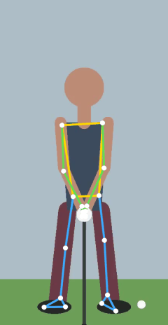
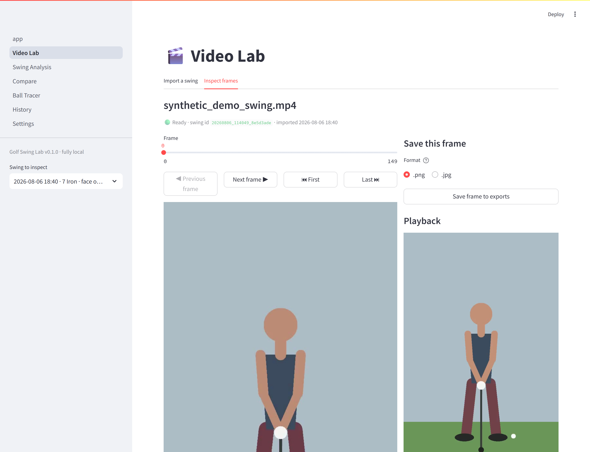
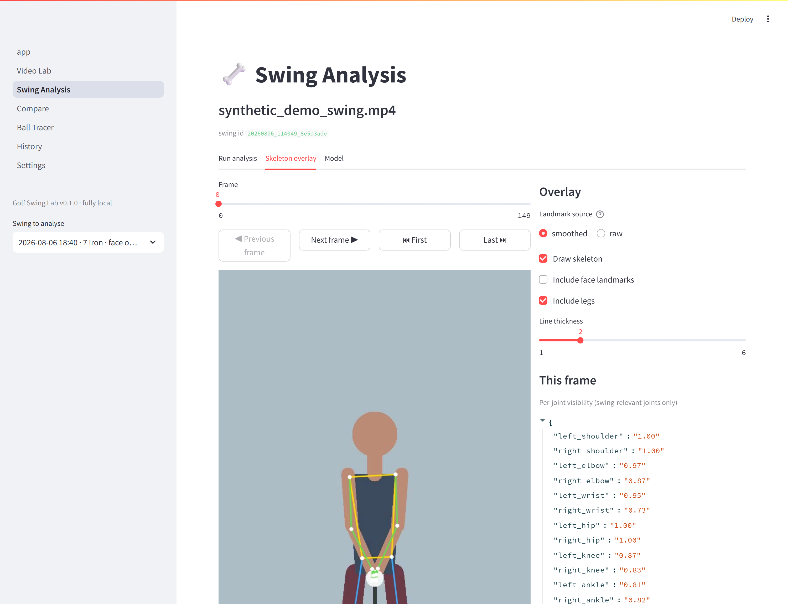
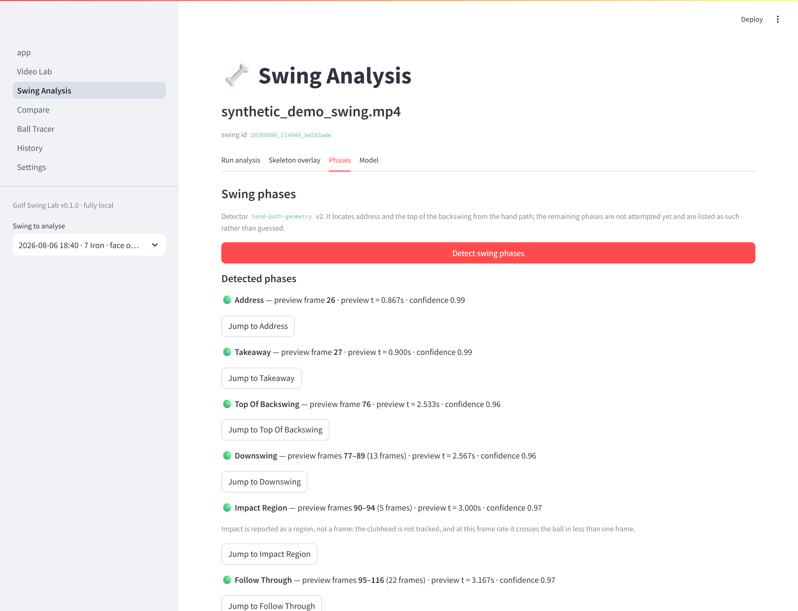

# Golf Swing Lab

**A private, fully local golf swing analysis workspace — import phone video,
run pose estimation on your own machine, and step through your swing frame by
frame with a confidence-aware skeleton overlay.**

[](https://github.com/johnsonto07/golf-swing-lab/actions/workflows/tests.yml)
[](pyproject.toml)
[](LICENSE)

<p align="center">
  
</p>

## The problem

Golf swing apps ask you to upload your video to someone else's server, pay a
subscription, and then hand you a confident-sounding number — *"your tempo is
2.8:1"* — with no way to tell whether the underlying measurement was any good.
Phone video is 2D, frame rates vary, and pose estimation fails silently on
fast-moving limbs. Most tools paper over all of that.

Golf Swing Lab takes the opposite stance. **Your video never leaves your
machine.** The computer proposes and you confirm. And when a measurement is not
trustworthy, the app says so instead of showing a number:

- frames where pose estimation failed are recorded as failed, never interpolated
- low-confidence joints are drawn faded, not hidden
- metrics that a camera angle cannot support are not offered for that angle
- clips whose timeline cannot be trusted are flagged before any numbers appear

## Releases and what's on `main`

| | |
|---|---|
| **[v0.2.0](https://github.com/johnsonto07/golf-swing-lab/releases/tag/v0.2.0)** | Milestone 2 — video import, preview normalization, pose model management, inference, smoothing, overlay, per-swing storage. |
| **`main` (unreleased)** | Everything in v0.2.0 **plus** the first Milestone 3 slice: address and top-of-backswing detection, camera-view metric gating, and the Phases tab. |

The tag is immutable and describes Milestone 2 only. If you want exactly what
was released, check out `v0.2.0`; if you want the phase work, use `main`.

## What works today (Milestone 2)

| | |
|---|---|
| **Import** | MP4/MOV/M4V from your phone. The original is copied once, marked read-only, and never re-encoded. |
| **Preview normalization** | A browser-safe, upright H.264 proxy — phone HEVC often will not play in a browser at all, and rotation is baked into the pixels. |
| **Frame stepping** | Exact single-frame prev/next with matching frame number and timestamp. |
| **Pose model management** | Three MediaPipe Pose Landmarker models with recorded source, licence, size, and SHA-256. Downloads only on an explicit click. |
| **Pose inference** | Runs locally on CPU, with throttled progress and per-frame cancellation. |
| **Skeleton overlay** | Per-joint confidence, toggleable face/legs, raw vs smoothed landmarks. |
| **Analysis storage** | Raw and smoothed landmarks stored separately per swing, with full provenance and staleness detection. |

<p align="center">
  
  <br><em>Video Lab — frame-accurate stepping, with original and preview metadata reported separately.</em>
</p>

<p align="center">
  
  <br><em>Swing Analysis — skeleton overlay with per-joint visibility for the swing-relevant joints.</em>
</p>

> **About the demo footage.** Every screenshot and the GIF above use a
> **synthetic figure**, generated by
> [`tools/make_demo_swing.py`](tools/make_demo_swing.py). No personal golf
> footage is in this repository. Regenerate the clip yourself with
> `python tools/make_demo_swing.py` and import it through the Video Lab.
> On real phone footage the pose stage typically detects 100% of frames; the
> synthetic figure detects ~98%.

### In progress (Milestone 3, first slice)

**Address** and **top of backswing** detection from the hand path, with a
camera-view-gated metric registry. A metric declares which views it supports
and is refused on the others *before* any computation runs — lateral hip sway
means something face-on and nothing down-the-line.

Every phase and metric carries an explicit status — `available`,
`low_confidence`, `missing_landmarks`, `unsupported_camera_view`,
`insufficient_frames`, `blocked_by_timing`, `detection_failed` — and only the
first two may carry a number. A missing measurement shows as "—", never `0.0`.

**Tempo and phase durations are deliberately not offered**, because they need
real source timing that variable-frame-rate clips do not currently provide.
See the limitation below.

<p align="center">
  
  <br><em>Phases — address and top located as preview frames, unattempted phases labelled as such, and metrics gated to the swing's camera view.</em>
</p>

**Not built yet:** reference comparison, ball tracer, and coaching. See the
[roadmap](#roadmap).

---

## Setup (Windows)

### 1. Install Python 3.10, 3.11, or 3.12

Not 3.13 — MediaPipe (needed from Milestone 2) has no wheels for it yet.

```powershell
winget install Python.Python.3.12
```

Check it:

```powershell
python --version
```

### 2. Install FFmpeg

Required. Video import, previews, and exports all depend on it.

```powershell
winget install Gyan.FFmpeg
```

**Close and reopen PowerShell**, then confirm:

```powershell
ffmpeg -version
ffprobe -version
```

If `ffmpeg` is not recognized, add its `bin` folder to your PATH and reopen the
terminal.

### 3. Create a virtual environment and install

From the project folder:

```powershell
cd path\to\golf_swing_lab

python -m venv .venv
.\.venv\Scripts\Activate.ps1

python -m pip install --upgrade pip
pip install -e ".[dev,pose]"
```

`[pose]` adds MediaPipe for pose estimation. Leave it out if you only want the
Video Lab — everything except Swing Analysis works without it.

**Install it as one command, exactly as written.** Installing bare
`mediapipe` afterwards will pull numpy 2 and OpenCV 5 and break the rest of the
stack. The extra re-pins numpy, scipy, and OpenCV for that reason. Confirm with:

```powershell
pip check
```

It should print `No broken requirements found.`

If PowerShell blocks the activate script:

```powershell
Set-ExecutionPolicy -Scope Process -ExecutionPolicy Bypass
```

### 4. Verify the environment

```powershell
python -m golf_lab.diagnostics
```

This prints Python and package versions, FFmpeg version, CPU/memory/GPU info,
writable directories, free disk space, and whether optional cloud coaching is
enabled. It never prints secrets — it is safe to paste anywhere.

---

## Run the app

```powershell
.\.venv\Scripts\Activate.ps1
streamlit run app.py
```

It opens at <http://localhost:8501>. To stop it, press `Ctrl+C` in the terminal.

To skip Streamlit's first-run email prompt:

```powershell
streamlit run app.py --server.headless true
```

---

## Using the Video Lab

1. Open **Video Lab → Import a swing**.
2. Choose an MP4 or MOV file.
3. Fill in club, camera view, handedness, and anything else you know.
   Camera view matters — later milestones only compute metrics the angle can
   actually support.
4. Click **Import swing**. Preview generation is the slow step; a progress bar
   shows where it is.
5. Switch to **Inspect frames**:
   - drag the slider for coarse positioning
   - **◀ Previous frame** / **Next frame ▶** step exactly one frame
   - frame number and timestamp are shown for the frame you are actually seeing
   - **Save frame to exports** writes a PNG or JPEG into the swing's
     `exports/` folder and offers a download

Your original file is copied into the swing folder and then marked read-only.
It is never edited, re-encoded, or overwritten.

For getting good footage in the first place, read
[docs/RECORDING_GUIDE.md](docs/RECORDING_GUIDE.md) — it matters more than any
feature here.

---

## Using Swing Analysis (pose overlay)

1. Open **Swing Analysis** and pick a swing.
2. Go to the **Model** tab and download a pose model. This is a **one-time
   download and the only time the app uses the internet.** Three are offered:
   Lite (~5.5 MB), Full (~9 MB, recommended), Heavy (~29 MB, most accurate but
   3–5× slower on CPU).
3. Go to **Run analysis** and click **Analyse this swing**. A progress bar
   shows where it is and **Cancel** stops it. A cancelled run saves nothing —
   a partial result is discarded rather than stored as if it were complete.
4. Go to **Skeleton overlay** to step through the result:
   - switch between **smoothed** and **raw** landmarks
   - toggle face landmarks and legs, adjust line thickness
   - per-joint visibility for the swing-relevant joints is listed per frame
   - **Save this frame with overlay** writes a PNG into `exports/`

### What the overlay is telling you

- **Faded joints are low-confidence.** They are dimmed rather than hidden on
  purpose: hiding them would make a shaky estimate look like a clean one with
  fewer joints. If a wrist is faint through the downswing, don't trust anything
  measured from that wrist.
- **"No pose was detected on this frame" means exactly that.** Frames where
  estimation failed are recorded as failed and left empty. They are never
  interpolated, and no measurement is derived from them.
- **Smoothing never crosses a gap.** Each run of detected frames is filtered on
  its own, so the app can't invent motion through frames where nothing was seen.
- **Raw is always kept.** `pose_raw.npz` is the evidence; `pose_smoothed.npz`
  is a convenience. Any number can be traced back to what was observed.

If a saved analysis is out of date — because the video changed or the analysis
version moved — the page says so **before** showing its numbers, rather than
presenting stale results as current.

### The Phases tab

Click **Detect swing phases**. It reads the stored landmarks — no model, no
network, about a millisecond — and reports:

- **Address** and **top of backswing** as preview frame numbers, with
  confidence and a jump-to button
- every other phase as "not attempted by this detector", which is a different
  statement from "attempted and failed"
- the metrics valid for this swing's camera view, each with a status and, when
  unavailable, the reason

Results are stored in `swing_analysis.json`, separate from the pose data.
Re-running phase detection never re-runs MediaPipe and never touches the
landmarks it was computed from.

---

## The pose model: what gets downloaded, and when

The repository ships **no model weights**. Downloading one is the *only* moment
this app touches the network, so it never happens on its own — `ensure_model()`
refuses to fetch unless explicitly told to, and the Download button on the
Swing Analysis **Model** tab is the only code path that passes that flag. A
test asserts that merely loading a page never starts a download.

| Model | Size | When to use |
|---|---|---|
| Lite | ~5.5 MB | quick look, or a slow machine |
| **Full** | ~9 MB | **default** — holds arms and hips at swing speed |
| Heavy | ~29 MB | most accurate, 3–5× the CPU time |

All three are Google's MediaPipe Pose Landmarker float16 bundles, Apache-2.0.
They land in `models/`, which is git-ignored.

Integrity is **trust-on-first-use, and the manifest says so.** Google publishes
no per-file checksums, so a pinned hash in the source would be security
theatre. What is recorded in `models/pose_models.json` is the SHA-256 of what
was actually downloaded, verified on every later load — that reliably catches a
truncated or corrupted file, but it cannot by itself prove the first download
was authentic. A model present without a recorded checksum is flagged rather
than assumed fine.

After the download, everything — inference, overlay, storage — runs offline.

## Architecture

```
pages/            Streamlit UI. Layout and user intent only.
golf_lab/
  config.py       paths, versions, tunables
  models/         Pydantic types = the on-disk serialization contract
  video/          decode, probe, preview, frame access
  pose/           landmarks, inference, smoothing, overlay, model management
  storage/        swing directories, metadata.json, pose artifacts
```

**Rule: no pipeline logic in `pages/`.** A page reads user intent, calls into
`golf_lab`, and renders the result — which is why the test suite can drive the
entire pipeline without importing Streamlit.

Three ideas do most of the work:

1. **A preview proxy, not the original.** Phone HEVC often will not play in a
   browser, scrubbing 4K is too slow to feel interactive, and OpenCV ignores
   container rotation. The preview solves all three. The original is copied
   once, marked read-only, and used only for final export.
2. **Optional dependencies stay optional.** `mediapipe` is imported lazily and
   only inside `pose/mediapipe_backend.py`. Every other pose module imports
   without it, so the suite runs with no model and no network via a fake
   backend.
3. **Uncertainty is data, not an exception.** Failed frames hold NaN and a
   `detected=False` flag; `pixel_coordinates()` returns `None` rather than an
   array of NaNs, forcing callers to handle "no pose here" explicitly.

Full detail in [docs/ARCHITECTURE.md](docs/ARCHITECTURE.md).

## Where your data lives

```
data/swings/<swing_id>/
    original.<ext>      your file, untouched and read-only
    preview.mp4         downscaled upright proxy for fast scrubbing
    thumbnail.jpg
    metadata.json       everything needed to reopen the swing
    pose_raw.npz        landmarks exactly as the model produced them
    pose_smoothed.npz   filtered copy for display and velocity work
    pose_info.json      which model, which versions, how good the result was
    exports/            saved frames and (later) rendered videos
data/logs/              rotating application log
models/                 downloaded pose models + pose_models.json manifest
```

Nothing under `data/` or `models/` is ever committed to Git. Delete a swing by
deleting its folder — the app deliberately does not delete your footage for you.

---

## Tests

```powershell
pytest
```

CI runs the same suite on Python 3.10, 3.11 and 3.12 against `main`, plus
`pip check` as a separate step — a green suite on a broken dependency set is
not a green build. CI reports **371 passed, 10 skipped**: the 10 are the
real-model integration tests, which skip by design because CI deliberately
never downloads a model from a third party.

381 tests covering metadata extraction, frame-rate parsing, rotation handling,
frame accuracy, timestamp conversion, preview generation and orientation,
filename sanitization, serialization round-trips, cache keys, diagnostics
secret-safety, the full import pipeline, and all of Milestone 2: the pose
`.npz` contract, gap-aware smoothing, overlay drawing, model management and
integrity, the inference loop, and staleness detection.

The UI acceptance tests run the real Streamlit page scripts and assert that
Next/Previous move exactly one frame, that the displayed frame number and
timestamp match, that saving a frame writes to `exports/`, that the original
file is untouched afterwards, that a frame with no pose says so, that a stale
analysis is flagged before its numbers are shown, and that **no page load ever
starts a model download**.

Test fixture videos are **generated** by FFmpeg at test time, so no private
golf footage ever enters the repository. Tests that need FFmpeg skip cleanly
if it is not installed. The pose pipeline is tested through a fake backend, so
the bulk of the suite needs neither MediaPipe nor a downloaded model nor a
network connection.

`tests/test_pose_integration.py` is the exception: 10 tests that exercise the
**real** MediaPipe backend against a real model file, verifying the landmark
count, array shapes and dtypes, coordinate normalization, storage round-trip,
and overlay drawing. They skip with a clear reason when MediaPipe is missing
or no model has been downloaded. Their subject is a drawn figure, not real
golf footage — enough to prove the plumbing is right, and deliberately not a
claim about accuracy on real swings, which only your own footage can establish.

---

## Known limitation: variable-frame-rate clips

Everything interactive reads the generated preview, not your original. For
constant-frame-rate footage the two are frame-for-frame equivalent. For
**variable-frame-rate** footage (many phone auto modes, slow-motion, screen
recordings) FFmpeg must resample to a constant rate to produce a
browser-playable proxy, so preview frame numbers and timestamps do **not** map
exactly back to your original file.

The app detects this, marks the swing "Needs review", and warns you on both the
Video Lab and Swing Analysis pages.

- **Unaffected:** the pose overlay, joint positions, confidence, saved frames.
- **Not yet reliable:** tempo ratios, phase durations, and frame-perfect
  comparison against the source.

None of those features exist yet, so no wrong number is being shown — the
restriction exists so they are not built on a foundation that would make them
wrong. Tracked as **GSL-1** in [docs/KNOWN_ISSUES.md](docs/KNOWN_ISSUES.md) and
must be resolved before Milestone 3 tempo work or Milestone 5 export.

## Roadmap

| | Milestone | Status |
|---|---|---|
| 0 | Environment, architecture, docs | ✅ done |
| 1 | Video Lab — import, frame stepping, export | ✅ done |
| 2 | Pose overlay — model management, inference, smoothing, storage | ✅ done |
| 1b | Recording-quality assessment | ⬜ planned |
| 3 | Swing phases and qualitative metrics | 🔜 in progress |
| 4 | Reference comparison | ⬜ planned |
| 5 | Manual ball tracer | ⬜ planned |
| 6 | Assisted tracking | ⬜ planned |
| 7 | Coaching (local rules first; cloud opt-in only) | ⬜ planned |
| 8 | History and progress | ⬜ planned |
| 9 | Custom detection research | ⬜ planned |

Tempo and phase durations in Milestone 3, and timing-sensitive ball-tracer
export in Milestone 5, are **blocked on
[issue #1](https://github.com/johnsonto07/golf-swing-lab/issues/1)** — see the
VFR limitation above. Full detail in [docs/ROADMAP.md](docs/ROADMAP.md).

## Privacy

- Everything runs locally. The **only** network access in the app is
  downloading a pose model, which happens once, on an explicit button press,
  from Google's published MediaPipe model storage. Your video never leaves your
  machine — inference, overlay, and storage are entirely local.
- No `OPENAI_API_KEY` is read, needed, or requested.
- Optional cloud coaching arrives in Milestone 7. It will be off by default,
  will require explicit per-swing opt-in before anything is sent, will send
  selected frames and computed observations rather than whole videos, and can
  be disabled entirely. The key would be read only from an environment
  variable by the local Python backend — never exposed to the browser, never
  logged, printed, or displayed.

---

## Documentation

| Document | Contents |
|---|---|
| [ARCHITECTURE.md](docs/ARCHITECTURE.md) | layering, data flow, caching, dependency decisions |
| [ROADMAP.md](docs/ROADMAP.md) | all ten milestones and their status |
| [DATA_MODEL.md](docs/DATA_MODEL.md) | on-disk formats, types, versioning |
| [RECORDING_GUIDE.md](docs/RECORDING_GUIDE.md) | how to film swings that are actually analysable |
| [LIMITATIONS.md](docs/LIMITATIONS.md) | **read this** — what 2D video can and cannot tell you |
| [KNOWN_ISSUES.md](docs/KNOWN_ISSUES.md) | tracked defects, with IDs the UI references |

## License

MIT — Copyright (c) 2026 Johnson To. See [LICENSE](LICENSE).

Bundled third-party components keep their own licences: the MediaPipe Pose
Landmarker models are Apache-2.0 and are downloaded at runtime, not
redistributed here.

---

## Troubleshooting

**"FFmpeg was not found on your PATH"** — install it (step 2), then reopen your
terminal and restart the app. The Settings page has a **Re-check environment**
button if you installed it while the app was running.

**Import fails with a codec error** — the message includes FFmpeg's own stderr.
Usually the fix is re-exporting the clip as H.264 MP4.

**Swing shows "Needs review" after import** — the preview's frame count did not
match the original's, which normally means the source is variable-frame-rate.
Frame numbers may be slightly offset. Recording with a fixed frame rate avoids
this.

**Video appears sideways** — please file this with the output of
`python -m golf_lab.diagnostics` and the `ffprobe` output for the clip;
orientation is handled explicitly and a failure would be a real bug.

**Streamlit says a port is in use** — `streamlit run app.py --server.port 8502`.

**"MediaPipe is not installed"** — run `pip install -e ".[dev,pose]"` in the
activated venv and restart the app.

**Pose estimation is slow** — it is CPU-bound and runs every frame. Switch to
the Lite model, or trim the clip before importing. A 4-second 120 fps clip is
480 frames of inference.

**Numpy or OpenCV errors after installing something new** — run `pip check`.
If it complains, reinstall with `pip install -e ".[dev,pose]"`, which restores
the verified combination. Installing `mediapipe` on its own is the usual cause.

**Pose model download fails** — it is the only step needing internet. Check
your connection and retry; a failed download leaves no partial file. If your
network blocks `storage.googleapis.com`, you can place the `.task` file in
`models/` manually, though it will then be flagged as having no recorded
checksum until you re-download it through the app.

**Windows "filename or extension is too long"** — the project path is too deep
for Windows' 260-character limit. Move the project somewhere short like
`C:\golf_swing_lab`, or create the venv at a short path (`python -m venv
C:\gsl-venv`). Inside the repo, `git config core.longpaths true` handles git's
side.
